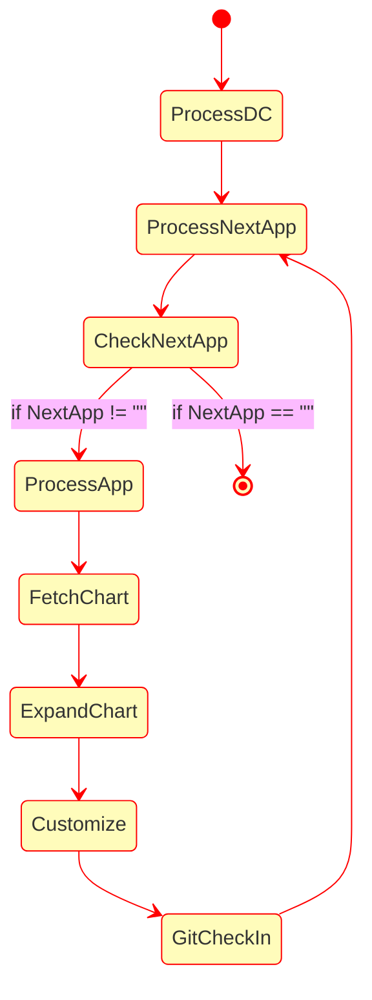

# Application Claim Docs

## Introduction
The motiviation for this project was to research application claim pattern.
This pattern allows applciations to have a ligth weight claim that is used
create a much more detailed resource. The deployment environment that is targeted
is Kubernetes and the resources that are targeted by these claims are infrastructure
resources like AWS RDS, S3 and other cloud provider services. The claim pattern
shields the applications from knowing anything about the cloud provider concerns
that are typically managed by a differents team that deploys the applciations
and manages cloud infrastructure.

There are examples of this pattern for example 
[crossplane composition](https://github.com/crossplane/crossplane/blob/master/design/one-pager-composition-revisions.md)
aims to support this claim pattern. Another example of this pattern is the
[db-controller](https://infobloxopen.github.io/db-controller) and its
[DatabaseClaim](https://infobloxopen.github.io/db-controller/#databaseclaim-custom-resource). 
The former crossplane claim pattern is very general purpose and more passive while
the db-controller claim is very specialized for database application and db-controller 
takes a more active role in managing the resource and provides database proxy and 
secret key rotation services.

In this project we will research some other patterns, the goal is to find a common
pattern(s) for application deployment.

## Additional Patterns
Generally infrastructure resources are injected into applications using configmap or secrets.
In addition to the pattern highlighted above we will look at two other patterns that build on
the established configmap or secret pattern. One problem with these patterns is that the
namespace and associated configmap or secret must be present for the application deployment
to succeed as the dependency is not present in the helm chart that is resolved.

The two approaches we will make is to:
- Use a workflow engine to process application defintion e.g. helm chart and use the application claim to create the create the resource
- Custom program that understands applications and the environment consumes application helm charts and emits resolved mainfest that coverts claims to resources

In general this the state flow in handling all the applications, in both approaches:


## Workflow Approach
In the workflow approach we would pick a solution that has a decralative workflow engine, two open source solutions
are good examples:
- [Kubevela](https://kubevela.io/docs/platform-engineers/workflow/workflow)
- [Argo Workflow](https://argoproj.github.io/argo-workflows/)

The two workflows solutions have different trades offs, kubevela is more specialized to CI/CD delivery has
native integration with helm and other tooling using its plugin architecture, while argo workflow is more
generalized and flexible in building workflows. The kubevela schema defintion could be a benefit if its 
fits your deployment model or problem as you have to define and model your configuration.

## Custom Approach
In the custom approach we will build an application that understands the data model for our 
deployment configuration repo (dc-repo), see this [example of dc-repo](https://github.com/seizadi/dc-repo).
This custom solution can still use open source tooling like
[kpt](https://github.com/GoogleContainerTools/kpt) or [QUE](https://cuelang.org/docs/about/) 
for declartive defintion and processing of the helm chart and creating resource configuration.

We could leverage [QUE integration in kubevela](https://seizadi.github.io/kubevela-poc/#que) or
[develope our own custom integration](https://cuelang.org/docs/integrations/k8s/).

The [kpt book](https://googlecontainertools.github.io/kpt/installation/)and 
[poc](https://github.com/seizadi/kpt-poc) are good resources. We will focus on
[kpt helm support](https://googlecontainertools.github.io/kpt/guides/ecosystem/helm/) as this
will be the source of our application defintion.

I will focus on kpt and how it can be integrated, as I feel that the QUE language and 
integration in kubevela is better understood at this time.

The kpt tool needs to have a resolved manifest for it to operate.
We can step through the test CMDB repo, note with CMDB when built for local
testing that postgres local server is run with the deployment, when run in the
cloud it is run with a claim. To enable this we set
postgresql.enabled to false:
```bash
mkdir deploy
cd tmp
git clone git@github.com:seizadi/cmdb.git
mkdir build
cd build
helm template --set postgresql.enabled=false -n cmdb ../cmdb/repo/cmdb/. --output-dir .
```

At this point this is what our directory structure would look like:
```bash
❯ tree cmdb
cmdb
└── templates
    ├── configmap.yaml
    ├── deployment.yaml
    ├── ingress.yaml
    ├── migrations.yaml
    ├── ns.yaml
    ├── postgres-claim.yaml
    ├── service.yaml
    └── serviceaccount.yaml
```
We are really intersted in the claim in postgres-claim.yaml:
```yaml
---
# Source: cmdb/templates/postgres-claim.yaml
apiVersion: database.example.org/v1alpha1
kind: PostgresInstance
metadata:
  name: RELEASE-NAME-cmdb
  namespace: cmdb
spec:
  parameters:
    storageGB: 20
  writeConnectionSecretToRef:
    name: RELEASE-NAME-cmdb-postgres-con
```

The goal now is to kpt to process this claim and convert it to a infrastructure claim.
We will use the kpt function pattern to search and replace the claim above with an
infrastructure defintion that looks like this:
```yaml
apiVersion: database.aws.crossplane.io/v1beta1
kind: RDSInstance
metadata:
  name: rdspostgresql
spec:
  forProvider:
    region: us-west-1
    vpcSecurityGroupIDRefs:
      - name: seizadi-bloxinabox-rds-sg
    dbSubnetGroupNameRef:
      name: seizadi-bloxinabox-rds-subnetgroup
    dbInstanceClass: <shape goes here>
    masterUsername: masteruser
    allocatedStorage: <minStorageGB goes here>
    engine: postgres
    engineVersion: "12.8"
    skipFinalSnapshotBeforeDeletion: true
    publiclyAccessible: false
    # enableIAMDatabaseAuthentication: true
  writeConnectionSecretToRef:
    namespace: <claim namespace goes here>
    name: <writeConnectionSecretToRef goes here>
  providerConfigRef:
    name: default
```
The [kpt function catalog](https://catalog.kpt.dev/) is a good place to look for
features to build for our required mutations.

We can do some processing of the helm chart as needed like mutating the namespace for the application
or setting it release name:
```bash
kpt fn eval --image gcr.io/kpt-fn/search-replace:v0.2.0 -- by-path='metadata.namespace' put-value='cmdb'
kpt fn eval --image gcr.io/kpt-fn/search-replace:v0.2.0 -- by-path='metadata.name' put-value='cmdb-dev-seizadi'
```
You should see changes like this:
```bash
diff --git a/deploy/build/cmdb/templates/configmap.yaml b/deploy/build/cmdb/templates/configmap.yaml
index 3ad3e33..813bf80 100644
--- a/deploy/build/cmdb/templates/configmap.yaml
+++ b/deploy/build/cmdb/templates/configmap.yaml
@@ -3,7 +3,7 @@ apiVersion: v1
 kind: ConfigMap
 metadata:
   name: RELEASE-NAME-cmdb
-  namespace: default
+  namespace: cmdb
```

We try to do the claim mutation by using 
[apply-replacements function](https://catalog.kpt.dev/apply-replacements/v0.1/) which uses the 
[kustomize synthax](https://kubectl.docs.kubernetes.io/references/kustomize/kustomization/replacements/)
for replacements.

```yaml
apiVersion: kpt.dev/v1
kind: Kptfile
metadata:
  name: claim
pipeline:
  mutators:
    - image: gcr.io/kpt-fn/apply-replacements:unstable
      configPath: replacements.yaml
```

We will define a kpt file to detail the desired changes:
```yaml
apiVersion: kpt.dev/v1
kind: Kptfile
metadata:
  name: claim
pipeline:
  mutators:
    - image: gcr.io/kpt-fn/apply-replacements:unstable
      configPath: replacements.yaml
```

Now we can process the claim:
```bash
kpt fn render claim
```
Now we can check what changed in the infrastructure defintion was updated:
```bash
diff --git a/deploy/claim/infrastructure.yaml b/deploy/claim/infrastructure.yaml
index e705744..ad2dce9 100644
--- a/deploy/claim/infrastructure.yaml
+++ b/deploy/claim/infrastructure.yaml
@@ -10,16 +10,16 @@ spec:
       - name: seizadi-bloxinabox-rds-sg
     dbSubnetGroupNameRef:
       name: seizadi-bloxinabox-rds-subnetgroup
-    dbInstanceClass: <shape goes here>
+    dbInstanceClass: db.t2.small
     masterUsername: masteruser
-    allocatedStorage: <minStorageGB goes here>
+    allocatedStorage: 20
     engine: postgres
     engineVersion: "12.8"
     skipFinalSnapshotBeforeDeletion: true
     publiclyAccessible: false
     # enableIAMDatabaseAuthentication: true
   writeConnectionSecretToRef:
-    namespace: <claim namespace goes here>
-    name: <writeConnectionSecretToRef goes here>
+    namespace: cmdb
+    name: RELEASE-NAME-cmdb-postgres-con
   providerConfigRef:
     name: default
```

