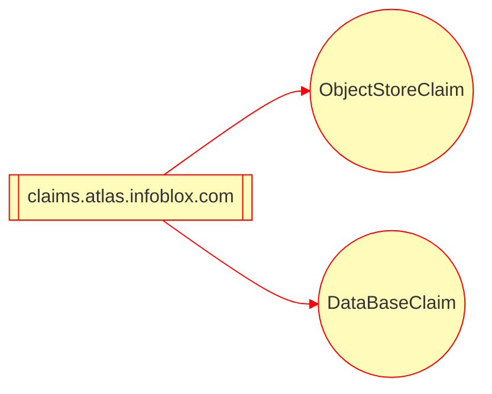
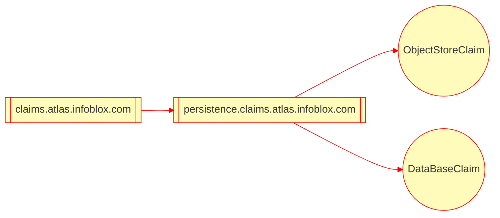
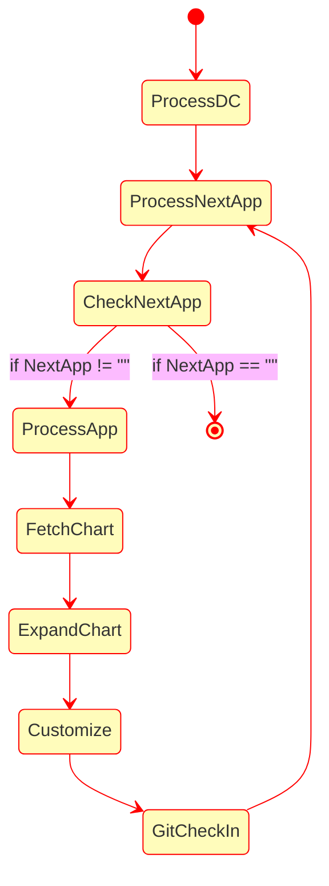

# Application Claim Docs

## Introduction
The motiviation for this project was to research application claim pattern.
This pattern allows applciations to have a ligth weight claim that is used
create a much more detailed resource. The deployment environment that is targeted
is Kubernetes and the resources that are targeted by these claims are infrastructure
resources like AWS RDS, S3 and other cloud provider services. The claim pattern
shields the applications from knowing anything about the cloud provider concerns
that are typically managed by a differents team that deploys the applciations
and manages cloud infrastructure.

There are examples of this pattern for example 
[crossplane composition](https://github.com/crossplane/crossplane/blob/master/design/one-pager-composition-revisions.md)
aims to support this claim pattern. Another example of this pattern is the
[db-controller](https://infobloxopen.github.io/db-controller) and its
[DatabaseClaim](https://infobloxopen.github.io/db-controller/#databaseclaim-custom-resource). 
The former crossplane claim pattern is very general purpose and more passive while
the db-controller claim is very specialized for database application and db-controller 
takes a more active role in managing the resource and provides database proxy and 
secret key rotation services.

In this project we will research some other patterns, the goal is to find a common
pattern(s) for application deployment.

## Operators versus Declarative Configuration
In the following analysis we will consider declarative configuration of infrastructure from
claims. This type of deployment might not fit some (or many) use cases where resources are shared 
and there is a need for reclaim policies enforced by an Operator, or there is specialized
processing of the infrastructure resources required e.g. health monitoring or backup.
It is intersting that 
[crossplane composition reclaim lifecycle was backed out recently](https://github.com/crossplane/crossplane-runtime/issues/179#issuecomment-671686000).
We will examine this decision once we have found all our use cases that will require
the claim pattern.

In this project we will define CRDs for the claims that we will use in the declarative
configuration. This will allow us to load them on the cluster and if necessary process them
using an Operator. We will seed the project with the kubebuilder db-controller project
scaffolding so we can use kubebuilder to build CRDs quickly but we will not implement any
runtime logic in this proejct.

The db-controller was setup for a single resource and we enable the project for
multigroup layout:
```bash
kubebuilder edit --multigroup true
```
There is work to refactor the definition from /api to /apis directory but since this is PoC,
I will not make these changes here.

We want the claim data model to follow the following schema:



We could have finer grained grouping:

For now we go with the coarse model, as most of the work is defining the leaf nodes.
We can refactor to the finer grain model once we have a better idea of the different 
claims needed for the applications.

We start by creating a claim for ObjectStore which we would map to AWS S3 resource for example:
```bash
kubebuilder create api --controller false --kind ObjectStoreClaim --version v1 --group objectstore.claims.atlas.infoblox.com
make update_crds
```

## Additional Patterns
Generally infrastructure resources are injected into applications using configmap or secrets.
In addition to the pattern highlighted above we will look at two other patterns that build on
the established configmap or secret pattern. One problem with these patterns is that the
namespace and associated configmap or secret must be present for the application deployment
to succeed as the dependency is not present in the helm chart that is resolved.

The two approaches we will make is to:
- Use a workflow engine to process application defintion e.g. helm chart and use the application claim to create the create the resource
- Custom program that understands applications and the environment consumes application helm charts and emits resolved mainfest that coverts claims to resources

In general this the state flow in handling all the applications, in both approaches:


## Workflow Approach
In the workflow approach we would pick a solution that has a decralative workflow engine, two open source solutions
are good examples:
- [Kubevela](https://kubevela.io/docs/platform-engineers/workflow/workflow)
- [Argo Workflow](https://argoproj.github.io/argo-workflows/)

The two workflows solutions have different trades offs, kubevela is more specialized to CI/CD delivery has
native integration with helm and other tooling using its plugin architecture, while argo workflow is more
generalized and flexible in building workflows. The kubevela schema defintion could be a benefit if its 
fits your deployment model or problem as you have to define and model your configuration.

## Custom Approach
In the custom approach we will build an application that understands the data model for our 
deployment configuration repo (dc-repo), see this [example of dc-repo](https://github.com/seizadi/dc-repo).
This custom solution can still use open source tooling like
[kpt](https://github.com/GoogleContainerTools/kpt) or [QUE](https://cuelang.org/docs/about/) 
for declartive defintion and processing of the helm chart and creating resource configuration.

We could leverage [QUE integration in kubevela](https://seizadi.github.io/kubevela-poc/#que) or
[develope our own custom integration](https://cuelang.org/docs/integrations/k8s/).

The [kpt book](https://googlecontainertools.github.io/kpt/installation/)and 
[poc](https://github.com/seizadi/kpt-poc) are good resources. We will focus on
[kpt helm support](https://googlecontainertools.github.io/kpt/guides/ecosystem/helm/) as this
will be the source of our application defintion.

I will focus on kpt and how it can be integrated, as I feel that the QUE language and 
integration in kubevela is better understood at this time.

The kpt tool needs to have a resolved manifest for it to operate.
We can step through the test CMDB repo, note with CMDB when built for local
testing that postgres local server is run with the deployment, when run in the
cloud it is run with a claim. To enable this we set
postgresql.enabled to false:
```bash
mkdir deploy
cd tmp
git clone git@github.com:seizadi/cmdb.git
mkdir build
cd build
helm template --set postgresql.enabled=false -n cmdb ../cmdb/repo/cmdb/. --output-dir .
```

At this point this is what our directory structure would look like:
```bash
❯ tree cmdb
cmdb
└── templates
    ├── configmap.yaml
    ├── deployment.yaml
    ├── ingress.yaml
    ├── migrations.yaml
    ├── ns.yaml
    ├── postgres-claim.yaml
    ├── service.yaml
    └── serviceaccount.yaml
```
We are really intersted in the claim in postgres-claim.yaml:
```yaml
---
# Source: cmdb/templates/postgres-claim.yaml
apiVersion: database.example.org/v1alpha1
kind: PostgresInstance
metadata:
  name: RELEASE-NAME-cmdb
  namespace: cmdb
spec:
  parameters:
    storageGB: 20
  writeConnectionSecretToRef:
    name: RELEASE-NAME-cmdb-postgres-con
```

The goal now is to kpt to process this claim and convert it to a infrastructure claim.
We will use the kpt function pattern to search and replace the claim above with an
infrastructure defintion that looks like this:
```yaml
apiVersion: database.aws.crossplane.io/v1beta1
kind: RDSInstance
metadata:
  name: rdspostgresql
spec:
  forProvider:
    region: us-west-1
    vpcSecurityGroupIDRefs:
      - name: seizadi-bloxinabox-rds-sg
    dbSubnetGroupNameRef:
      name: seizadi-bloxinabox-rds-subnetgroup
    dbInstanceClass: <shape goes here>
    masterUsername: masteruser
    allocatedStorage: <minStorageGB goes here>
    engine: postgres
    engineVersion: "12.8"
    skipFinalSnapshotBeforeDeletion: true
    publiclyAccessible: false
    # enableIAMDatabaseAuthentication: true
  writeConnectionSecretToRef:
    namespace: <claim namespace goes here>
    name: <writeConnectionSecretToRef goes here>
  providerConfigRef:
    name: default
```
The [kpt function catalog](https://catalog.kpt.dev/) is a good place to look for
features to build for our required mutations.

We can do some processing of the helm chart as needed like mutating the namespace for the application
or setting it release name:
```bash
kpt fn eval --image gcr.io/kpt-fn/search-replace:v0.2.0 -- by-path='metadata.namespace' put-value='cmdb'
kpt fn eval --image gcr.io/kpt-fn/search-replace:v0.2.0 -- by-path='metadata.name' put-value='cmdb-dev-seizadi'
```
You should see changes like this:
```bash
diff --git a/deploy/build/cmdb/templates/configmap.yaml b/deploy/build/cmdb/templates/configmap.yaml
index 3ad3e33..813bf80 100644
--- a/deploy/build/cmdb/templates/configmap.yaml
+++ b/deploy/build/cmdb/templates/configmap.yaml
@@ -3,7 +3,7 @@ apiVersion: v1
 kind: ConfigMap
 metadata:
   name: RELEASE-NAME-cmdb
-  namespace: default
+  namespace: cmdb
```

We try to do the claim mutation by using 
[apply-replacements function](https://catalog.kpt.dev/apply-replacements/v0.1/) which uses the 
[kustomize synthax](https://kubectl.docs.kubernetes.io/references/kustomize/kustomization/replacements/)
for replacements.

```yaml
apiVersion: kpt.dev/v1
kind: Kptfile
metadata:
  name: claim
pipeline:
  mutators:
    - image: gcr.io/kpt-fn/apply-replacements:unstable
      configPath: replacements.yaml
```

We will define a kpt file to detail the desired changes:
```yaml
apiVersion: kpt.dev/v1
kind: Kptfile
metadata:
  name: claim
pipeline:
  mutators:
    - image: gcr.io/kpt-fn/apply-replacements:unstable
      configPath: replacements.yaml
```

Now we can process the claim:
```bash
kpt fn render claim
```
Now we can check what changed in the infrastructure defintion was updated:
```bash
diff --git a/deploy/claim/infrastructure.yaml b/deploy/claim/infrastructure.yaml
index e705744..ad2dce9 100644
--- a/deploy/claim/infrastructure.yaml
+++ b/deploy/claim/infrastructure.yaml
@@ -10,16 +10,16 @@ spec:
       - name: seizadi-bloxinabox-rds-sg
     dbSubnetGroupNameRef:
       name: seizadi-bloxinabox-rds-subnetgroup
-    dbInstanceClass: <shape goes here>
+    dbInstanceClass: db.t2.small
     masterUsername: masteruser
-    allocatedStorage: <minStorageGB goes here>
+    allocatedStorage: 20
     engine: postgres
     engineVersion: "12.8"
     skipFinalSnapshotBeforeDeletion: true
     publiclyAccessible: false
     # enableIAMDatabaseAuthentication: true
   writeConnectionSecretToRef:
-    namespace: <claim namespace goes here>
-    name: <writeConnectionSecretToRef goes here>
+    namespace: cmdb
+    name: RELEASE-NAME-cmdb-postgres-con
   providerConfigRef:
     name: default
```

This shows simple mutations but there might be cases where you need to implement
conditional logic or more complex mutations rather than replace/substitutions.
For example see the more complex operations available to
[crossplane compositions](https://github.com/crossplane/crossplane/blob/master/design/design-doc-composition.md#transform-functions) to transform claims.

In these cases in the case of kpt we have [starlark scripting](https://catalog.kpt.dev/starlark/v0.4/).
[starlark](https://docs.bazel.build/versions/main/skylark/language.html) 
is is a dialect of Python. It is commonly used as a configuration language. 
It is an untyped dynamic language with high-level data types, first-class functions with lexical scope, 
and garbage collection. You can find the spec for the Starlark language 
[here](https://github.com/bazelbuild/starlark/blob/master/spec.md). 
You can also find its API reference [here](https://docs.bazel.build/versions/main/skylark/lib/skylark-overview.html).

We will do a example of claim transformation using this method as well.

POC USING STARLARK SCRIPT GOES HERE!

## Application Use Cases

Lets look at some common use cases below

### Container Args
In this use case you have something like this:
```yaml
      containers:
        - name: <some-container>
        .....
          args:
            - --s3-region=<some region>
            - --s3-bucket=<some bucket>
            - --s3-folder=<some folder>
        .....
```
There is also the associated secret and you can have this injected via Secrets, 
use node IAM permission, kube2iam or IRSA.

This declaration does not tell us if the S3 resource is shared by other applciations.
If it is shared does not application need read only or read/write access to the resource.
The application claim should also include these intents.

The clients will use AWS SDK to access the object store, we have to test other cloud providers
but they are suppose to be able to support the API calls with their own endpoints:
```go
import(
	"github.com/aws/aws-sdk-go/aws"
	"github.com/aws/aws-sdk-go/aws/session"
	"github.com/aws/aws-sdk-go/service/s3"
	"github.com/aws/aws-sdk-go/service/s3/s3manager"
)
...
    awsConfig := &aws.Config{
    Region:     aws.String(s3-region),
    HTTPClient: &http.Client{Timeout: defaultHTTPTimeout},
    Endpoint:   &config.Endpoint,
    }
    awsSession, _ := session.NewSession(awsConfig)
    svc = s3.New(awsSession)
    downloader = s3manager.NewDownloader(awsSession)
...
```
The ConfigMap pattern is another one found in applications, you can refrence
the open source solution [Teleport](https://github.com/gravitational/teleport)
in how it pulls persistence information for its configuration:
```yaml
---
# Source: teleport/templates/config.yaml
apiVersion: v1
kind: ConfigMap
metadata:
  name: teleport
data:
  teleport.yaml: |
    teleport:
      log:
        output: stderr
        severity: DEBUG
      data_dir: /var/lib/teleport

      auth_servers:
      - teleport.ib-system.svc.cluster.local:3025
      - auth-poseidon-preprod.csp.infoblox.com:3025

      storage:
        audit_events_uri:
        - "dynamodb://<some-dynamodb>"
        audit_sessions_uri: "s3://<some-bucket>"
```

Another example similarly for configuration of 
[FOSSA](https://github.com/fossas)
using ConfigMap:
```yaml
---
# Source: fossa-core/templates/config/config-configmap.yaml
apiVersion: v1
kind: ConfigMap
metadata:
  name: fossa-config
  namespace: fossa
data:
  config.json: |-
    {
      "db": {
        "port": 5432,
        "username": "root",
        "database": "fossa",
        "host": "<some aws rds host>",
        "pool": {
          "maxConnections": 5,
          "minConnections": 1,
          "maxIdleTime": 60000
        }
      },
      "cache": {
        "package": {
          "engine": "s3",
          "store_private": true,
          "bucket": "<some-bucket>",
          "s3Options": {
            "endpoint": "s3.amazonaws.com"
          }
        }
      },
```
In these cases you need to have a declarative defintion of the signature for the
persistence claims.

There is a CLI tool to help research 
[dc-repo]() configuration.

Local configuration
```bash
make build
./bin/claims --help
```

Docker run
```bash
docker run ghcr.io/seizadi/claims --help
```

You can run it like this:
```bash
claims search --dir <path to k8 manifests> --stage dev --env env-4 --app some-app s3 rds amazonaws.com
```

Here is a sample, showing how you can use the tool to determine that a claim for a
resource is shared by two different environments:
```bash
❯ ./bin/claims search --dir /Users/seizadi/projects/src/github.com/seizadi/k8s.manifests some-resource.amazonaws.com
some-resource.amazonaws.com [dev/env-4/some-app integration/env-2/another-app]
```
Try to visualize this data using graph DB:
```bash
docker run -p7474:7474 -p7687:7687 -e NEO4J_AUTH=neo4j/s3cr3t neo4j
```

A bit more advanced:
```bash
docker run \
    --name testneo4j \
    -p7474:7474 -p7687:7687 \
    -d \
    -v $HOME/neo4j/data:/data \
    -v $HOME/neo4j/logs:/logs \
    -v $HOME/neo4j/import:/var/lib/neo4j/import \
    -v $HOME/neo4j/plugins:/plugins \
    --env NEO4J_AUTH=neo4j/s3cr3t \
    neo4j:latest
```

In case it is not clear why we are thinking about this as a graph
problem. In particular for Neo4J, 
we want to create a record, where each record will contain
information on :App and :Resource nodes, and 
the :ACCESS relationship. The :ACCESS relationship will
have boolean .Props Read and Write to indicate access
types. Both App and Resources
would have name .Props. For Resources we would
define .Props Type with values like (ObjectStore or Database). 

You can use this tool to populate the database and
then using the graph query editor to visulaize the data
```genericsql
match(n:App)-[r:ACCESS]->(m:Resource) return n,r,m
```
Then to filter to only the dev stage:
```genericsql
match(n:App)-[r:ACCESS]->(m:Resource) where n.stage = "dev" return n,r,m
```
